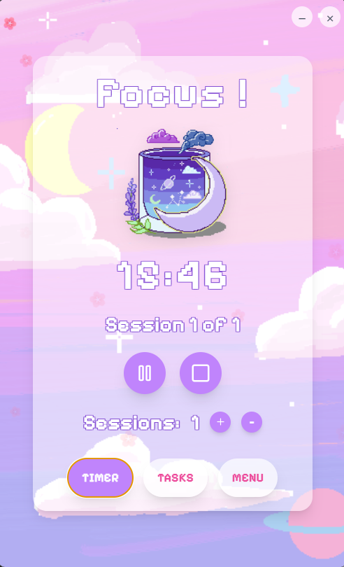
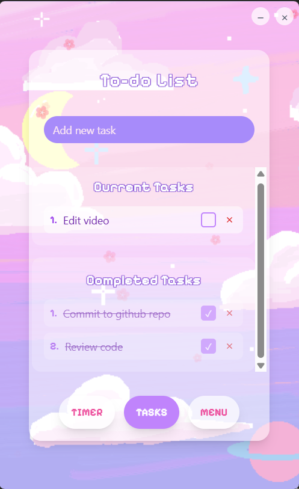
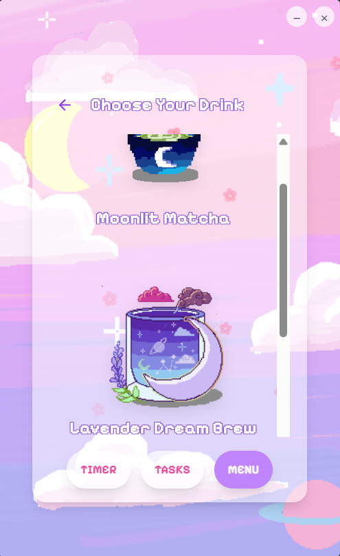

# 🌸 Cute Pomodoro Timer

> *Transform your productivity with magic, one Pomodoro at a time.* ✨

A beautiful desktop Pomodoro timer featuring hand-crafted animated drinks, floating sakura petals, and an enchanting aesthetic that makes focus sessions feel like magic. Built with excitement and curiosity using React and Electron.

## ✨ Features

### Animated Drinks
- Hand-crafted original artwork with GIF animations
- Moonlit Matcha with steam and glitter effects
- Lavender Dream Brew and Sakura Spirit Soda
- Each drink brings its own personality to your focus sessions

### Magical Atmosphere
- Floating sakura petals create a peaceful ambiance
- Cozy background artwork that calms the mind
- Glassmorphism effects for a dreamy interface
- Custom frameless window design

### Smart Pomodoro Flow
- **25 minutes** of focused work time
- **5 minutes** of relaxing break time
- Automatic transitions between sessions
- Customizable number of sessions

### Built-in Task Management
- Add and organize your focus tasks
- Check off completed items
- Separate views for current and completed tasks

### Audio Feedback
- Satisfying button click sounds
- Gentle hover effects
- A gentle sound reminder to know when sessions are starting or ending

### Aesthetic Design
- Original pixelated artwork
- Animations and micro-interactions
- Dreamy pastel color palette


## Screenshots

| Timer View | Tasks View | Menu View |
|------------|------------|-----------|
|  |  |  |

## Quick Start

### For Users (Just Want to Use the App)

1. **[Download the Latest Release](https://github.com/thethtarzin111/aesthetic-projects/releases)**
2. **Run the installer** (`pomodoro-timer.exe`)
3. **Start focusing** with your new magical productivity companion! ✨

*No technical setup required - just download and enjoy!*

### For Developers (Want to Run from Source)

**Prerequisites:**
- Node.js 16+ 
- npm or yarn
- Git

**Setup:**
```bash
# Clone the repository
git clone https://github.com/thethtarzin111/aesthetic-projects.git
cd aesthetic-projects/pomodoro-timer

# Install dependencies
npm install

# Start development mode
npm run dev

# In another terminal, start Electron
npm run electron
```

**Build your own executable:**
```bash
npm run build
npm run package-win  # Creates Windows .exe
```

## How to Use

### Starting Your First Session
1. **Choose your drink companion** from the menu
2. **Add tasks** you want to focus on
3. **Click play** to start your 25-minute focus session
4. **Take a break** when the timer automatically switches
5. **Repeat** for your desired number of sessions

### Customizing Your Experience
- **Sessions**: Use +/- buttons to set how many focus sessions you want
- **Drinks**: Switch between different animated companions anytime
- **Tasks**: Add, complete, or remove tasks as needed
- **Window**: Drag anywhere on the background to move the app

## 🎨 Original Artwork

All visual assets are **100% original artwork** created specifically for this project:

| Moonlit Matcha | Lavender Dream Brew | Sakura Kitsune Soda |
|------------|------------|-----------|
|  |  |  |

*Feel free to use this artwork in your own projects with attribution!*

## Tech Stack

- **Frontend**: React 18, Vite
- **Desktop**: Electron
- **Styling**: Tailwind CSS
- **Icons**: Lucide React

## System Requirements

- **Windows 10** or newer
- **~200MB** disk space
- **No additional software** required for the .exe version

## 💖 Support

Love this project? Here's how you can show your support:

- **Star this repository** on GitHub
- **Share it** with your productive friends

## 🌸 Final Words

This project was born from a love of aesthetic design, productivity and romanticizing the mundane. 

May your focus sessions be productive and your breaks be refreshing! 

---
